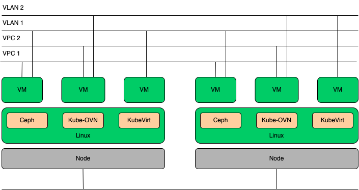

# Vink

[英文文档](./README.en.md)

Vink（Virtual Machines in Kubernetes）是基于 KubeVirt 构建的开源云原生虚拟化平台，为 Kubernetes 提供原生虚拟机全生命周期管理能力。通过深度集成 Kube-OVN 网络插件、Rook-Ceph 分布式存储、External-Snapshotter 快照系统，以及 Prometheus & Grafana 监控体系，构建了轻量化云原生虚拟化平台。

## 功能

- **易于安装:** 您可以直接在 Kubernetes 集群上，使用 Helm 安装它。

- **虚拟机管理:** 轻松创建、删除、编辑、克隆、快照、实时迁移虚拟机。

- **镜像管理:** 提供镜像导入和共享功能。

- **网络管理:** 支持 VLAN Underlay/Overlay 混合网络、多网络接口与弹性 IP（EIP）。如果外部网络需要连接到虚拟机，建议使用 VLAN 或未标记的 Underlay 网络，它直接使用物理网络地址，与物理网络高效互联；否则推荐使用 Overlay 网络，它能提供更多功能（如 VPC、ACL 和虚拟子网）。

- **存储管理:** 支持分布式存储，支持快照、克隆以及虚拟机的实时扩容和实时迁移。

- **监控:** 提供虚拟机、节点、Ceph 存储和 Kube-OVN 组件的监控数据。

- **Kubernetes 原生集成:** 使用 Kubernetes 原生 API 部署虚拟机。

- **可扩展性与高可用性:** 自动扩展和故障转移机制确保虚拟机的可靠性。

## 架构



- **KubeVirt** 是 Kubernetes 的虚拟机管理组件，通过 CRD 扩展机制实现容器与虚拟机的统一编排。

- **Kube-OVN** 和 **Multus** 是 Kubernetes 的网络插件，为虚拟机提供 SDN（软件定义网络）能力。同时支持 Underlay/Overlay 混合网络。

- **Rook-Ceph** 是 Kubernetes 平台上的分布式存储解决方案，支持块存储和文件存储。其中块存储提供快照、克隆及动态扩容等高级特性，文件存储则具备实时迁移能力，可满足不同场景的持久化存储需求。

- **Prometheus** 和 **Grafana** 是监控与可视化工具，可用于监控 Vink 运行状态。

## 快速开始

[Dashboard](./docs/dashboard.md)

[Host](./docs/host.md)

[Virtual Machine Management](./docs/vm-management.md)

[Volume](./docs/volume.md)

[Network](./docs/network.md)

### 安装

使用 Helm 安装 Vink，运行以下命令：

```bash
helm upgrade --install --create-namespace --namespace vink vink oci://registry-1.docker.io/hejianmin/vink --wait --timeout 1800s --debug
```

```bash
NAME             	NAMESPACE  	REVISION	UPDATED                                	STATUS  	CHART                       	APP VERSION
cdi              	cdi        	4       	2025-02-25 10:44:52.800527214 +0000 UTC	deployed	cdi-0.0.1-f1a26a48          	0.0.1-f1a26a48
kube-ovn         	kube-system	4       	2025-02-25 10:41:34.938708426 +0000 UTC	deployed	kube-ovn-v1.13.3            	1.13.3
kubevirt         	kubevirt   	4       	2025-02-25 10:44:36.199738081 +0000 UTC	deployed	kubevirt-0.0.1-f1a26a48     	0.0.1-f1a26a48
monitoring       	monitoring 	4       	2025-02-25 10:42:21.451281681 +0000 UTC	deployed	kube-prometheus-stack-69.5.1	v0.80.1
rook-ceph        	rook-ceph  	4       	2025-02-25 10:41:45.758136708 +0000 UTC	deployed	rook-ceph-v1.16.4           	v1.16.4
rook-ceph-cluster	rook-ceph  	4       	2025-02-25 10:41:52.442879278 +0000 UTC	deployed	rook-ceph-cluster-v1.16.4   	v1.16.4
vink             	vink       	4       	2025-02-25 10:40:41.148996124 +0000 UTC	deployed	vink-0.0.1-165797c0         	0.0.1-165797c0
```

### 清理

要卸载 Vink 并删除所有相关资源，请使用：

```bash
helm delete --namespace vink vink
```
