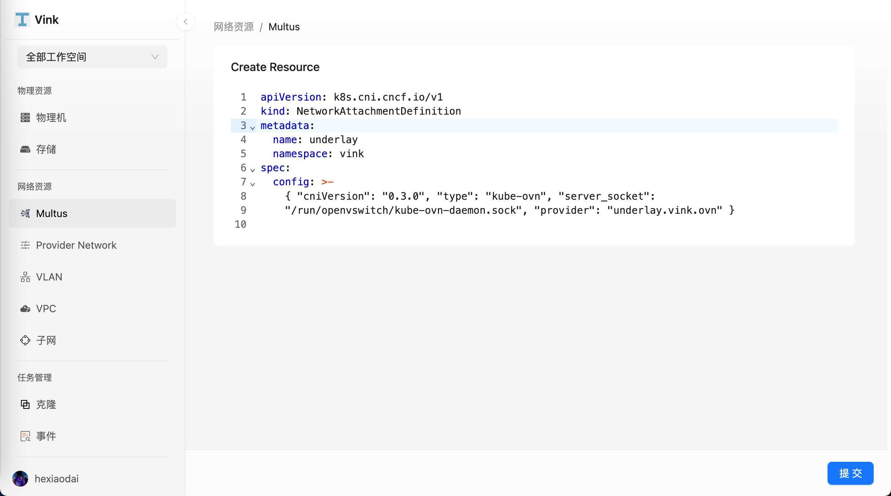
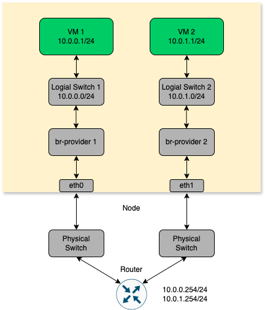
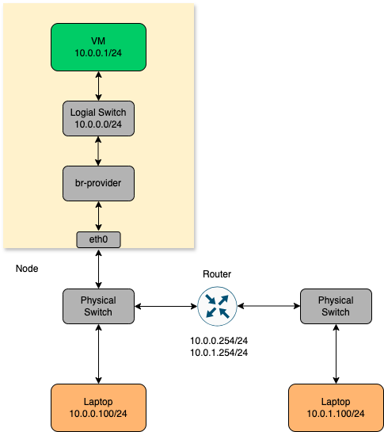

- [网络](#网络)
  - [创建 Overlay 网络](#创建-overlay-网络)
    - [创建具有 Overlay 网络的虚拟机](#创建具有-overlay-网络的虚拟机)
  - [创建 Underlay 网络](#创建-underlay-网络)
    - [创建具有 Underlay 网络的虚拟机](#创建具有-underlay-网络的虚拟机)
  - [Underlay/Overlay 混合网络](#underlayoverlay-混合网络)
    - [创建具有 Underlay/Overlay 混合网络的虚拟机](#创建具有-underlayoverlay-混合网络的虚拟机)
  - [Underlay 流量拓扑](#underlay-流量拓扑)
    - [同节点同子网](#同节点同子网)
    - [跨节点同子网](#跨节点同子网)
    - [同节点不同子网](#同节点不同子网)
    - [跨节点不同子网](#跨节点不同子网)
    - [访问外部](#访问外部)
    - [无 VLAN Tag](#无-vlan-tag)
    - [多 VLAN Tag](#多-vlan-tag)

# 网络

Vink 利用 Multus 和 Kube-OVN CNI 插件，实现 Underlay/Overlay 混合网络架构。

- **Overlay 网络：** 基于 Kube-OVN，采用 VXLAN/GENEVE 等隧道技术，为虚拟机提供 SDN（软件定义网络）能力。支持 VPC 多租户隔离、ACL 访问控制及跨节点通信，同时保持对底层物理网络的独立性。

- **Underlay 网络：** 基于 Kube-OVN 的 Underlay 网络模式，虚拟机可直接使用物理网络地址段，与物理网络高效互联。在此模式下，OVS（Open vSwitch）将节点物理网卡桥接到 OVS 网桥，数据包经网卡直发，借助底层网络设备的二层或三层转发功能，实现优异的网络性能和与物理网络的无缝连接。

这种混合架构融合了 Underlay 网络的高性能与 Overlay 网络的灵活性，能适应多样化的网络需求。

## 创建 Overlay 网络

前往 `网络资源` > `Multus` 页面，选择 `创建 Multus`。

前往 `网络资源` > `子网` 页面，选择 `创建子网`。

### 创建具有 Overlay 网络的虚拟机

您现在可以使用上面配置的网络创建新的虚拟机：

前往 `虚拟资源` > `虚拟机` 页面，选择 `创建虚拟机` > `网络` > `网络接口` > `添加网络`

## 创建 Underlay 网络

前往 `网络资源` > `Multus` 页面，选择 `创建 Multus`。

前往 `网络资源` > `Provider Network` > `创建 Provider Network`

前往 `网络资源` > `VLAN` > `创建 VLAN`

前往 `网络资源` > `子网` > `创建子网`

### 创建具有 Underlay 网络的虚拟机

您现在可以使用上面配置的网络创建新的虚拟机：

前往 `虚拟资源` > `虚拟机` 页面，选择 `创建虚拟机` > `网络` > `网络接口` > `添加网络`

## Underlay/Overlay 混合网络

### 创建具有 Underlay/Overlay 混合网络的虚拟机

您现在可以使用上面配置的 Underlay 和 Overlay 网络配置，创建同时拥有 Underlay 和 Overlay 网络的虚拟机：

前往 `虚拟资源` > `虚拟机` 页面，选择 `创建虚拟机` > `网络` > `网络接口` > `添加网络`，依次添加 Overlay 和 Underlay 网络

## Underlay 流量拓扑

本文档介绍 Underlay 模式下流量在不同情况下的转发路径。

### 同节点同子网

内部逻辑交换机直接交换数据包，不进入外部网络。

### 跨节点同子网

数据包经由节点网卡进入外部交换机，由外部交换机进行交换。

### 同节点不同子网

数据包经由节点网卡进入外部网络，由外部交换机及路由器进行交换和路由转发。

### 跨节点不同子网

数据包经由节点网卡进入外部网络，由外部交换机及路由器进行交换和路由转发。

### 访问外部

数据包经由节点网卡进入外部网络，由外部交换机及路由器进行交换和路由转发。

### 无 VLAN Tag

### 多 VLAN Tag

