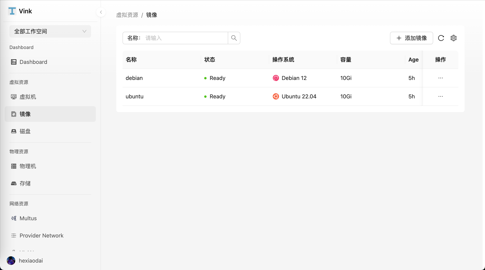
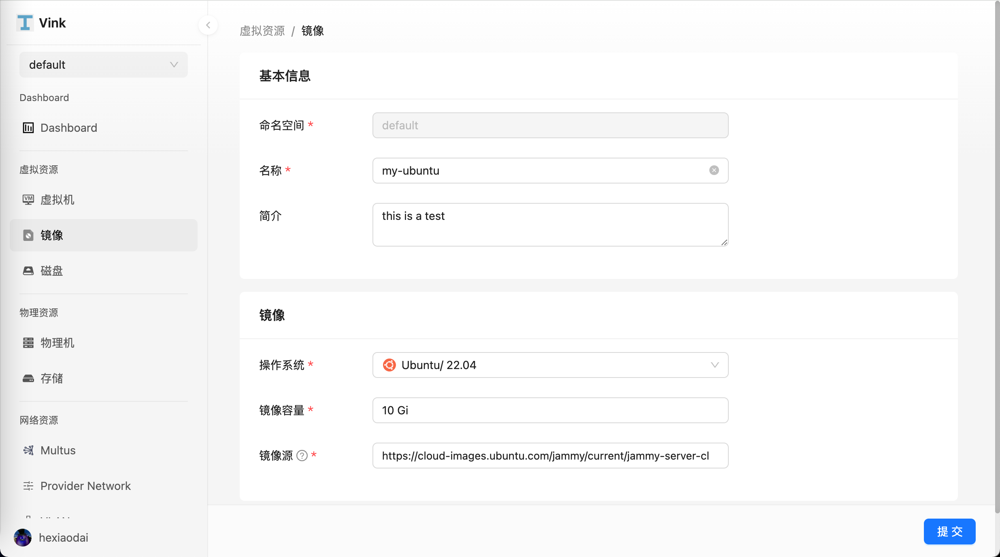
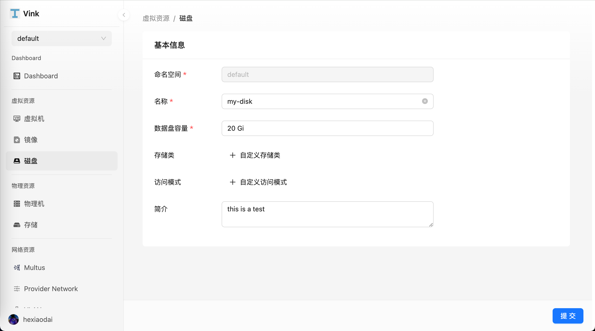

# Quickstart Guides

## 创建虚拟机

本文将介绍如何在 Vink 上创建虚拟机。

Vink 基于 KubeVirt 技术将虚拟机作为云原生应用进行管理，与容器无缝地衔接在一起，使用户能够轻松地部署虚拟机应用，享受与容器应用一致的丝滑体验。

### 前提条件

创建虚拟机之前，需要满足以下前提条件：

- 向用户机操作系统公开硬件辅助的虚拟化。
- 在指定集群安装 Vink，操作系统内核版本需要在 3.15 以上。
- 提前准备好操作系统镜像，平台内置默认镜像 (如下文所示)，如需制作镜像，可参考开源项目制作镜像。

### 镜像创建

参考以下步骤，使用镜像创建一个操作系统镜像。

1. 点击左侧导航栏上的 `虚拟资源` > `镜像`，进入 `镜像列表` 页面。

2. 在镜像列表页面，点击 `添加镜像`。

3. 进入镜像创建页面，依次填写基本信息、镜像配置，在页面右下角点击 `确定` 完成创建。

镜像来源：支持三种类型的来源。

- 镜像仓库类型：镜像存储在容器镜像仓库中，支持从镜像仓库中按需选择镜像；
- HTTP 类型：镜像存储于 HTTP 协议的文件服务器中，支持 HTTPS:// 和 HTTP:// 前缀；
- 对象存储（S3）：支持通过对象存储协议 (S3) 获取的虚拟机镜像，若是无需认证的对象存储文件，请使用 HTTP 来源。

#### 磁盘创建

参考以下步骤，创建一个磁盘作为虚拟机的数据盘。

1. 点击左侧导航栏上的 `虚拟资源` > `磁盘`，进入 `磁盘列表` 页面。

2. 在磁盘列表页面，点击 `添加磁盘`。

3. 进入镜像创建页面，依次填写基本信息，在页面右下角点击 `确定` 完成创建。

### 基本信息

点击左侧导航栏上的 `虚拟资源` > `虚拟机`，进入 `虚拟机列表` 页面。

- 命名空间：选择将新建的虚拟机部署在哪个命名空间。

- 名称：最多包含 63 个字符，只能包含小写字母、数字及分隔符（“-”），且必须以小写字母或数字开头及结尾。 同一命名空间内名称不得重复，而且名称在虚拟机创建好之后不可更改。

- 系统镜像：选择要创建的虚拟机所使用的镜像。

### 计算资源

CPU 建议使用整数，若填写小数将自动向上取整。支持 CPU 和内存的热加载。如需配置 CPU 或内存超配，请在虚拟机创建完成后使用编辑功能进行调整。

### 存储

- 存储和虚拟机的功能息息相关，主要是通过使用 Kubernetes 的持久卷和存储类，提供了灵活且可扩展的虚拟机存储能力。比如虚拟机镜像存储在 PVC 里，支持和其他数据一起克隆、快照等。Vink 默认使用 Rook-Ceph 作为默认存储类，支持块存储和文件存储，默认使用块存储。

- 系统盘：系统默认创建一个 Virt IO 类型的 rootfs 系统盘，用于存放操作系统和数据。系统盘的容量需要大于系统镜像的大小。

- 数据盘：数据盘是虚拟机中用于存储用户数据、应用程序数据或其他非操作系统相关文件的存储设备。与系统盘相比，数据盘是非必选的，可以根据需要动态添加或移除。数据盘的容量也可以根据需求进行灵活配置。

- 默认使用块存储。如果需要使用克隆和快照功能，请确保您的存储池已经创建了对应的 VolumeSnapshotClass，可以参考以下示例。如果需要使用实时迁移功能，请确保您的存储支持并选择了 ReadWriteMany 的访问模式。

### 网络

- 虚拟机的网络能力由 Kubernetes CNI（容器网络接口）插件提供，允许虚拟机拥有灵活的网络拓扑和多种连接方式。Vink 默认使用 Kube-OVN CNI 提供基础网络能力，同时支持 Multus 实现多网卡功能，支持 Overlay 网络、Underlay 网络、VPC 和 ACL 规则，为用户提供灵活可控的网络环境。

### 登录设置

用户名/密码：可以通过用户名和密码登录至虚拟机。
