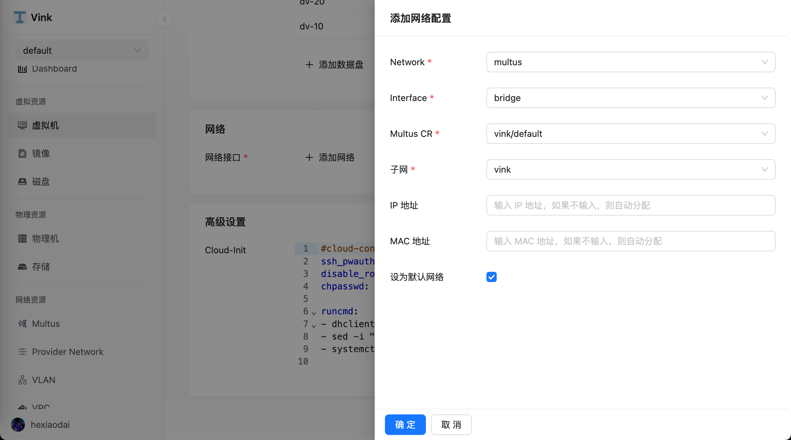

- [虚拟机管理](#虚拟机管理)
  - [虚拟机列表](#虚拟机列表)
  - [创建虚拟机](#创建虚拟机)
    - [基本信息](#基本信息)
    - [计算资源](#计算资源)
    - [存储](#存储)
    - [网络](#网络)
    - [登录设置](#登录设置)
  - [编辑虚拟机](#编辑虚拟机)
    - [磁盘](#磁盘)
    - [网络](#网络)
    - [快照](#快照)
      - [从快照中恢复](#从快照中恢复)
    - [克隆](#克隆)

# 虚拟机管理

## 虚拟机列表

1. 前往 `虚拟资源` > `虚拟机` 页面。

## 创建虚拟机

1. 前往 `虚拟资源` > `虚拟机`，进入 `虚拟机列表` 页面，选择 `创建虚拟机`。

### 基本信息

虚拟机在创建时会从指定的系统镜像启动，并将其写入系统盘。如何创建镜像，请参阅[镜像页面](./volume.md#镜像)。

### 计算资源

CPU 建议使用整数，若填写小数将自动向上取整。支持 CPU 和内存的热加载。如需配置 CPU 或内存超配，请在虚拟机创建完成后使用编辑功能进行调整。

### 存储

系统盘大小需要大于系统镜像大小。如何创建磁盘，请参阅[磁盘页面](./volume.md#磁盘)。

### 网络

可为虚拟机添加多张网卡，每张网卡可以配置不同的网络，支持 Underlay/Overlay 网络共存。如何创建网络，请参阅[网络页面](./network.md)。

### 登录设置

用户名/密码：可以通过用户名和密码登录至虚拟机。

## 编辑虚拟机

创建虚拟机后，您可以点击虚拟机进入详情页面，并通过切换选项卡查看虚拟机的基础信息、监控、磁盘、网卡、快照等内容。此外，您还可以对虚拟机进行相关管理操作，如调整资源配置、挂载/卸载磁盘、修改网络设置、创建快照和克隆等，以满足业务需求。

> 编辑完成虚拟机之后，还需要重启虚拟机以使配置更改生效。

### 磁盘

点击 `磁盘` 选项卡，添加额外的磁盘。如何创建磁盘，请参阅[磁盘页面](./volume.md#磁盘)。

点击右上角 `∙∙∙` 按钮，选择 `添加磁盘`，进入添加磁盘弹窗框。

点击右上角 `∙∙∙` 按钮，选择 `电源` > `重启` 按钮重启虚拟机，以使配置更改生效。

点击右上角 `∙∙∙` 按钮，选择 `打开控制台` 按钮，连接到虚拟机。输入 `lsblk` 命令，查看虚拟机的磁盘信息。

### 网络

点击 `网络` 选项卡，添加额外的网络。如何创建网络，请参阅[网络页面](./network.md)。

点击右上角 `∙∙∙` 按钮，选择 `添加网络`。

点击右上角 `∙∙∙` 按钮，选择 `电源` > `重启` 按钮重启虚拟机，以使配置更改生效。

点击右上角 `∙∙∙` 按钮，选择 `打开控制台` 按钮，连接到虚拟机。输入 `ip a` 命令，查看虚拟机的网卡信息。

### 快照

点击 `快照` 选项卡，进入虚拟机快照页面。

点击右上角 `∙∙∙` 按钮，选择 `创建快照`。

点击右上角 `∙∙∙` 按钮，选择 `打开控制台`，连接到虚拟机，执行 `echo 1 > 1.txt` 往虚拟机中写入数据。

点击右上角 `∙∙∙` 按钮，选择 `创建快照`，为写入 `1.txt` 数据之后的虚拟机创建快照。

点击右上角 `∙∙∙` 按钮，选择 `打开控制台`，连接到虚拟机，执行 `echo 2 > 2.txt` 往虚拟机中写入数据。

#### 从快照中恢复

点击右上角 `∙∙∙` 按钮，选择 `电源` > `关机` 按钮关闭虚拟机。

选择快照，点击 `从快照中恢复` 按钮，等待虚拟机恢复完成。

点击右上角 `∙∙∙` 按钮，选择 `电源` > `启动`，启动虚拟机。

点击右上角 `∙∙∙` 按钮，选择 `打开控制台`，连接到虚拟机，执行 `ls & cat 1.txt` 查看写入的数据是否正常。

### 克隆

克隆一个与原始虚拟机配置相同的虚拟机。包括磁盘、网络和登录设置等。

> 克隆之后的虚拟机会继承原始虚拟机的网络配置，重新分配网卡的 IP 和 MAC 地址。

点击右上角 `∙∙∙` 按钮，选择 `克隆`，输入克隆虚拟机名称，点击 `确定` 按钮。

前往 `任务管理` > `克隆`，进入 `克隆列表` 页面，查看克隆虚拟机的状态。

前往 `虚拟资源` > `虚拟机`，进入 `虚拟机列表` 页面，启动克隆的虚拟机。

点击右上角 `∙∙∙` 按钮，选择 `打开控制台`，连接到虚拟机，执行 `ls & cat 1.txt` 查看克隆的虚拟机是否与原始虚拟机写入的数据相同。

