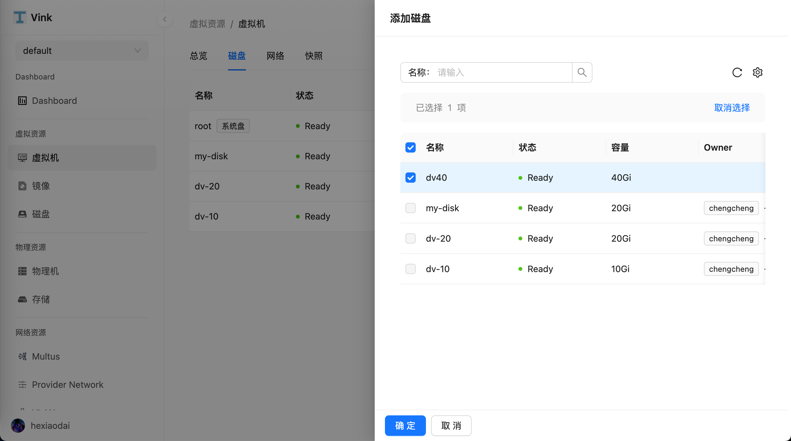
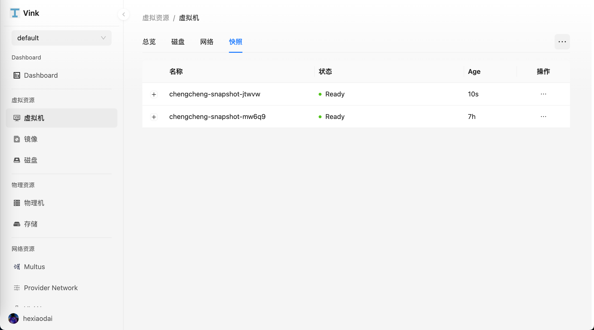

- [虚拟机管理](#虚拟机管理)
  - [创建虚拟机](#创建虚拟机)
    - [基本信息](#基本信息)
    - [计算资源](#计算资源)
    - [存储](#存储)
    - [网络](#网络)
    - [登录设置](#登录设置)
  - [编辑虚拟机](#编辑虚拟机)
  - [磁盘](#磁盘)
  - [网络](#网络)
  - [快照](#快照)
    - [从快照中恢复虚拟机](#从快照中恢复虚拟机)
  - [克隆](#克隆)

# 虚拟机管理

## 创建虚拟机

点击左侧导航栏上的 `虚拟资源` > `虚拟机`，进入 `虚拟机列表` 页面，选择 `创建虚拟机`。

### 基本信息

- 命名空间：选择将新建的虚拟机部署在哪个命名空间。

- 名称：最多包含 63 个字符，只能包含小写字母、数字及分隔符（“-”），且必须以小写字母或数字开头及结尾。 同一命名空间内名称不得重复，而且名称在虚拟机创建好之后不可更改。

- 系统镜像：选择要创建的虚拟机所使用的镜像。

### 计算资源

CPU 建议使用整数，若填写小数将自动向上取整。支持 CPU 和内存的热加载。如需配置 CPU 或内存超配，请在虚拟机创建完成后使用编辑功能进行调整。

### 存储

- 存储和虚拟机的功能息息相关，主要是通过使用 Kubernetes 的持久卷和存储类，提供了灵活且可扩展的虚拟机存储能力。比如虚拟机镜像存储在 PVC 里，支持和其他数据一起克隆、快照等。Vink 默认使用 Rook-Ceph 作为默认存储类，支持块存储和文件存储，默认使用块存储。

- 系统盘：系统默认创建一个 Virt IO 类型的 rootfs 系统盘，用于存放操作系统和数据。系统盘的容量需要大于系统镜像的大小。

- 数据盘：数据盘是虚拟机中用于存储用户数据、应用程序数据或其他非操作系统相关文件的存储设备。与系统盘相比，数据盘是非必选的，可以根据需要动态添加或移除。数据盘的容量也可以根据需求进行灵活配置。

- 默认使用块存储。如果需要使用克隆和快照功能，请确保您的存储池已经创建了对应的 VolumeSnapshotClass，可以参考以下示例。如果需要使用实时迁移功能，请确保您的存储支持并选择了 ReadWriteMany 的访问模式。

### 网络

- 虚拟机的网络能力由 Kubernetes CNI（容器网络接口）插件提供，允许虚拟机拥有灵活的网络拓扑和多种连接方式。Vink 默认使用 Kube-OVN CNI 提供基础网络能力，同时支持 Multus 实现多网卡功能，支持 Overlay 网络、Underlay 网络、VPC 和 ACL 规则，为用户提供灵活可控的网络环境。

### 登录设置

用户名/密码：可以通过用户名和密码登录至虚拟机。

## 编辑虚拟机

创建虚拟机后，您可以点击虚拟机详情来编辑您的虚拟机。

> 编辑完成虚拟机之后，还需要重启虚拟机以使配置更改生效。

## 磁盘

您可以在启动虚拟机实例后添加额外的磁盘，如何创建磁盘，请参阅[磁盘页面](./disk.md)。

点击左侧导航栏上的 `虚拟资源` > `虚拟机`，进入 `虚拟机列表` 页面，选择虚拟机并且进入虚拟机详情页面。

进入虚拟机详情页面之后，点击 `磁盘` 选项卡。

点击右上角 `∙∙∙` 按钮，选择 `添加磁盘`，进入添加磁盘弹窗框。

点击右上角 `∙∙∙` 按钮，选择 `电源` > `重启` 按钮重启虚拟机，以使配置更改生效。

点击右上角 `∙∙∙` 按钮，选择 `打开控制台` 按钮，连接到虚拟机。输入 `lsblk` 命令，查看虚拟机的磁盘信息。

## 网络

您可以在启动虚拟机实例后添加额外的网络，如何创建网络，请参阅[网络页面](./network.md)。

点击左侧导航栏上的 `虚拟资源` > `虚拟机`，进入 `虚拟机列表` 页面，选择虚拟机并且进入虚拟机详情页面。

进入虚拟机详情页面之后，点击 `网络` 选项卡。

点击右上角 `∙∙∙` 按钮，选择 `添加网络`。

进入添加网络弹窗框，配置以下参数：
  - Network
  - Interface
  - Multus CR
  - 子网

点击右上角 `∙∙∙` 按钮，选择 `电源` > `重启` 按钮重启虚拟机，以使配置更改生效。

点击右上角 `∙∙∙` 按钮，选择 `打开控制台` 按钮，连接到虚拟机。输入 `ip a` 命令，查看虚拟机的网卡信息。

## 快照

点击左侧导航栏上的 `虚拟资源` > `虚拟机`，进入 `虚拟机列表` 页面，选择虚拟机并且进入虚拟机详情页面。

进入虚拟机详情页面之后，点击 `快照` 选项卡。

点击右上角 `∙∙∙` 按钮，选择 `创建快照`。

点击右上角 `∙∙∙` 按钮，选择 `打开控制台`，连接到虚拟机，执行 `echo 1 > 1.txt` 往虚拟机中写入数据。

点击右上角 `∙∙∙` 按钮，选择 `创建快照`，为写入 `1.txt` 数据之后的虚拟机创建快照。

点击右上角 `∙∙∙` 按钮，选择 `打开控制台`，连接到虚拟机，执行 `echo 2 > 2.txt` 往虚拟机中写入数据。

### 从快照中恢复虚拟机

点击右上角 `∙∙∙` 按钮，选择 `电源` > `关机` 按钮关闭虚拟机。

在 `快照` 选项卡中，选择快照，点击 `从快照中恢复` 按钮。

等待虚拟机恢复完成。

点击右上角 `∙∙∙` 按钮，选择 `电源` > `启动`，启动虚拟机。

点击右上角 `∙∙∙` 按钮，选择 `打开控制台`，连接到虚拟机，执行 `ls & cat 1.txt` 查看写入的数据是否正常。

## 克隆

点击右上角 `∙∙∙` 按钮，选择 `克隆`，输入克隆虚拟机名称，点击 `确定` 按钮。

点击左侧导航栏上的 `任务管理` > `克隆`，进入 `克隆列表` 页面，查看克隆虚拟机的状态。

点击左侧导航栏上的 `虚拟资源` > `虚拟机`，进入 `虚拟机列表` 页面。启动克隆的虚拟机。

点击右上角 `∙∙∙` 按钮，选择 `打开控制台`，连接到虚拟机，执行 `ls & cat 1.txt` 查看克隆的虚拟机是否与原始虚拟机写入的数据相同。

> 克隆之后的虚拟机会重新分配网卡的 IP 和 MAC 地址。

