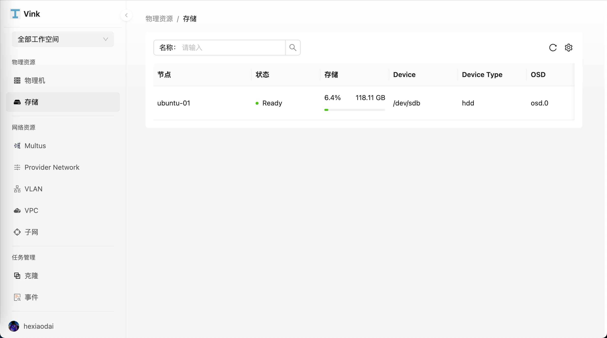
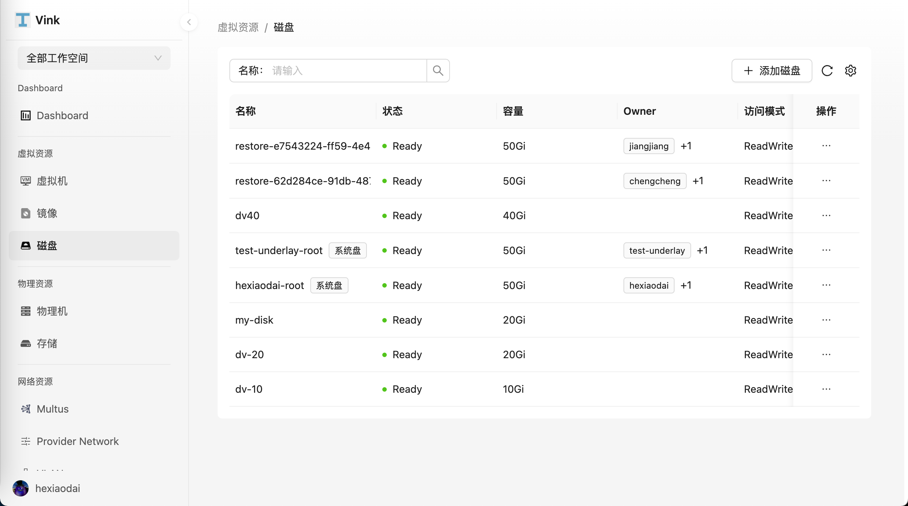
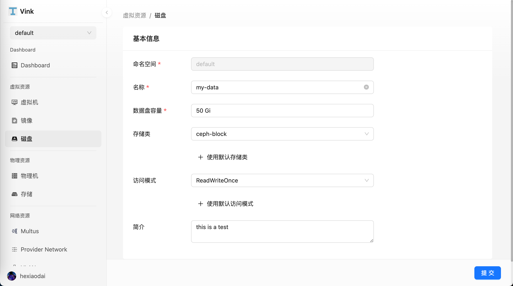
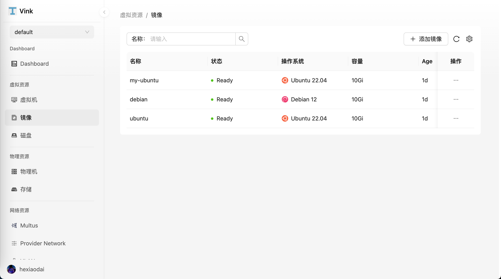
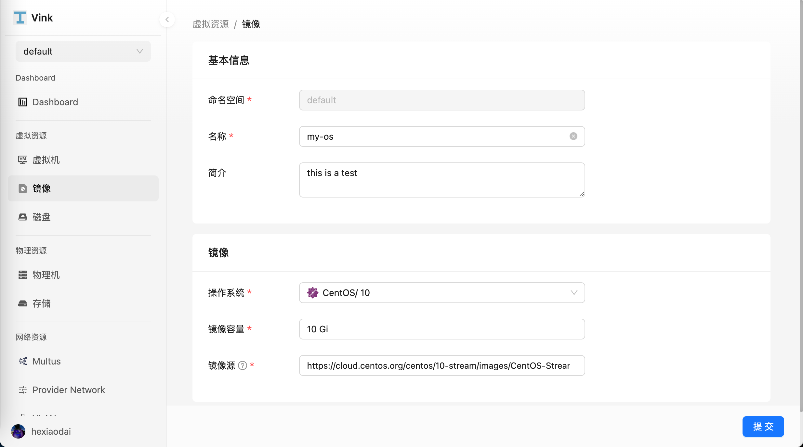

- [存储](#存储)
  - [物理磁盘](#物理磁盘)
  - [虚拟机存储](#虚拟机存储)
  - [磁盘](#磁盘)
    - [磁盘列表](#磁盘列表)
    - [创建磁盘](#创建磁盘)
  - [镜像](#镜像)
    - [镜像列表](#镜像列表)
    - [创建镜像](#创建镜像)

# 存储

Vink 使用 Rook-Ceph 作为默认存储插件。支持块存储和文件存储，默认使用块存储。

存储和虚拟机的功能息息相关，主要是通过使用 Kubernetes 的持久卷和存储类，提供了灵活且可扩展的虚拟机存储能力。比如虚拟机镜像存储在 PVC 里，支持和其他数据一起克隆、快照等。

## 物理磁盘

物理磁盘直接与物理服务器连接的存储设备，用于提供虚拟机的持久化存储。在 Vink 中，物理磁盘可以通过 Rook-Ceph 管理和虚拟化，从而为 Kubernetes 中的虚拟机提供高效的块存储和文件存储服务。物理磁盘通过 Rook-Ceph 的 RBD 和 CephFS 插件进行管理，确保存储资源的高可用性、扩展性和灵活性。

## 虚拟机存储

- 系统盘：系统默认创建一个 Virt IO 类型的 rootfs 系统盘，用于存放操作系统和数据。系统盘的容量需要大于系统镜像实际的大小。

- 数据盘：数据盘是虚拟机中用于存储用户数据、应用程序数据或其他非操作系统相关文件的存储设备。与系统盘相比，数据盘是非必选的，可以根据需要动态添加或移除。数据盘的容量也可以根据需求进行灵活配置。

  默认使用 `rook-ceph.rbd.csi.ceph.com` 存储类，并采用 ReadWriteOnce 访问模式创建 RBD 存储卷。如果需要使用实时迁移功能，请选择 `rook-ceph.cephfs.csi.ceph.com` 存储类，并使用 ReadWriteMany 访问模式。

- 系统镜像：系统镜像是虚拟机的基础映像文件，包含操作系统及相关的预装软件。系统镜像可以基于标准发行版（如 Ubuntu、CentOS、Debian）或自定义构建，以满足不同业务需求。虚拟机在创建时会从指定的系统镜像启动，并将其写入系统盘。

## 磁盘

### 磁盘列表

磁盘列表用于展示当前系统中所有已创建的磁盘，并提供直观的管理视图。您可以在该页面快速查看磁盘的名称、状态、容量、Owner、访问模式和存储类等关键信息。

前往 `虚拟资源` > `磁盘` 页面。

### 创建磁盘

前往 `虚拟资源` > `磁盘` > `添加磁盘` 页面。

## 镜像

### 镜像列表

镜像列表用于展示当前系统中所有已创建的系统镜像，并提供直观的管理视图。您可以在该页面快速查看系统镜像的名称、状态、操作系统、容量等关键信息。

前往 `虚拟资源` > `镜像` 页面。

### 创建镜像

前往 `虚拟资源` > `镜像` > `添加镜像` 页面。

